# DiffusionPipeline API 文档

## 类图关系

```mermaid
classDiagram
    %% 基础类
    class ConfigMixin {
        +config_name: str
        +ignore_for_config: List[str]
        +has_compatibles: bool
        +from_config(config) ConfigMixin
        +save_config(save_directory)
        +to_dict() Dict
        +register_to_config(**kwargs)
    }

    class PushToHubMixin {
        +push_to_hub(repo_id, **kwargs)
        +create_model_card(**kwargs)
    }

    class ModelMixin {
        +device: torch.device
        +dtype: torch.dtype
        +save_pretrained(save_directory)
        +from_pretrained(pretrained_model_name_or_path) Self
        +to(device) Self
        +enable_gradient_checkpointing()
        +disable_gradient_checkpointing()
    }

    class SchedulerMixin {
        +config_name: str
        +_compatibles: List[str]
        +has_compatibles: bool
        +save_pretrained(save_directory)
        +from_pretrained(pretrained_model_name_or_path) Self
    }

    %% 核心Pipeline类
    class DiffusionPipeline {
        +config_name: str = "model_index.json"
        +model_cpu_offload_seq: Optional[str]
        +hf_device_map: Optional[Dict]
        +_optional_components: List[str]
        +_exclude_from_cpu_offload: List[str]
        +_load_connected_pipes: bool
        +_is_onnx: bool
        
        +register_modules(**kwargs)
        +save_pretrained(save_directory, **kwargs)
        +from_pretrained(pretrained_model_name_or_path, **kwargs) Self
        +to(*args, **kwargs) Self
        +device: torch.device
        +dtype: torch.dtype
        +components: Dict[str, Any]
        +enable_model_cpu_offload(gpu_id, device)
        +enable_sequential_cpu_offload(gpu_id, device)
        +remove_all_hooks()
        +enable_xformers_memory_efficient_attention(attention_op)
        +disable_xformers_memory_efficient_attention()
        +enable_attention_slicing(slice_size)
        +disable_attention_slicing()
        +progress_bar(iterable, total)
        +set_progress_bar_config(**kwargs)
        +numpy_to_pil(images) List[PIL.Image]
        +from_pipe(pipeline, **kwargs) Self
    }

    class FlaxDiffusionPipeline {
        +config_name: str = "model_index.json"
        +register_modules(**kwargs)
        +save_pretrained(save_directory, **kwargs)
        +from_pretrained(pretrained_model_name_or_path, **kwargs) Self
        +numpy_to_pil(images) List[PIL.Image]
    }

    %% 具体Pipeline实现
    class StableDiffusionPipeline {
        +vae: AutoencoderKL
        +text_encoder: CLIPTextModel
        +tokenizer: CLIPTokenizer
        +unet: UNet2DConditionModel
        +scheduler: SchedulerMixin
        +safety_checker: StableDiffusionSafetyChecker
        +feature_extractor: CLIPImageProcessor
        
        +__call__(prompt, **kwargs) StableDiffusionPipelineOutput
        +enable_vae_slicing()
        +disable_vae_slicing()
        +enable_vae_tiling()
        +disable_vae_tiling()
        +enable_freeu(s1, s2, b1, b2)
        +disable_freeu()
    }

    class StableDiffusionXLPipeline {
        +vae: AutoencoderKL
        +text_encoder: CLIPTextModel
        +text_encoder_2: CLIPTextModelWithProjection
        +tokenizer: CLIPTokenizer
        +tokenizer_2: CLIPTokenizer
        +unet: UNet2DConditionModel
        +scheduler: SchedulerMixin
        
        +__call__(prompt, **kwargs) StableDiffusionXLPipelineOutput
        +encode_prompt(prompt, **kwargs)
    }

    class FluxPipeline {
        +transformer: FluxTransformer2DModel
        +scheduler: FlowMatchEulerDiscreteScheduler
        +vae: AutoencoderKL
        +text_encoder: CLIPTextModel
        +text_encoder_2: T5EncoderModel
        +tokenizer: CLIPTokenizer
        +tokenizer_2: T5Tokenizer
        
        +__call__(prompt, **kwargs) FluxPipelineOutput
    }

    %% 模型组件
    class UNet2DConditionModel {
        +sample_size: int
        +in_channels: int
        +out_channels: int
        +down_block_types: List[str]
        +up_block_types: List[str]
        +block_out_channels: List[int]
        +layers_per_block: int
        +attention_head_dim: Union[int, List[int]]
        +cross_attention_dim: Union[int, List[int]]
        
        +forward(sample, timestep, encoder_hidden_states, **kwargs) UNet2DConditionOutput
        +set_attention_slice(slice_size)
        +enable_freeu(s1, s2, b1, b2)
        +disable_freeu()
    }

    class AutoencoderKL {
        +in_channels: int
        +out_channels: int
        +down_block_types: List[str]
        +up_block_types: List[str]
        +block_out_channels: List[int]
        +latent_channels: int
        +sample_size: int
        
        +encode(x, return_dict) AutoencoderKLOutput
        +decode(z, return_dict) DecoderOutput
        +forward(sample, **kwargs) DecoderOutput
        +enable_slicing()
        +disable_slicing()
        +enable_tiling()
        +disable_tiling()
    }

    %% 调度器
    class DDIMScheduler {
        +num_train_timesteps: int
        +beta_start: float
        +beta_end: float
        +beta_schedule: str
        +prediction_type: str
        +timestep_spacing: str
        
        +set_timesteps(num_inference_steps, device)
        +step(model_output, timestep, sample, **kwargs) DDIMSchedulerOutput
        +add_noise(original_samples, noise, timesteps) torch.Tensor
    }

    class EulerDiscreteScheduler {
        +num_train_timesteps: int
        +beta_start: float
        +beta_end: float
        +beta_schedule: str
        +prediction_type: str
        +use_karras_sigmas: bool
        
        +set_timesteps(num_inference_steps, device)
        +step(model_output, timestep, sample, **kwargs) EulerDiscreteSchedulerOutput
        +add_noise(original_samples, noise, timesteps) torch.Tensor
    }

    class FlowMatchEulerDiscreteScheduler {
        +num_train_timesteps: int
        +timestep_spacing: str
        +shift: float
        
        +set_timesteps(num_inference_steps, device)
        +step(model_output, timestep, sample, **kwargs) FlowMatchEulerDiscreteSchedulerOutput
    }

    %% 继承关系
    ConfigMixin <|-- DiffusionPipeline
    PushToHubMixin <|-- DiffusionPipeline
    ConfigMixin <|-- FlaxDiffusionPipeline
    PushToHubMixin <|-- FlaxDiffusionPipeline
    
    DiffusionPipeline <|-- StableDiffusionPipeline
    DiffusionPipeline <|-- StableDiffusionXLPipeline
    DiffusionPipeline <|-- FluxPipeline
    
    ModelMixin <|-- UNet2DConditionModel
    ConfigMixin <|-- UNet2DConditionModel
    ModelMixin <|-- AutoencoderKL
    ConfigMixin <|-- AutoencoderKL
    
    SchedulerMixin <|-- DDIMScheduler
    ConfigMixin <|-- DDIMScheduler
    SchedulerMixin <|-- EulerDiscreteScheduler
    ConfigMixin <|-- EulerDiscreteScheduler
    SchedulerMixin <|-- FlowMatchEulerDiscreteScheduler
    ConfigMixin <|-- FlowMatchEulerDiscreteScheduler

    %% 组合关系
    StableDiffusionPipeline *-- UNet2DConditionModel : unet
    StableDiffusionPipeline *-- AutoencoderKL : vae
    StableDiffusionPipeline *-- SchedulerMixin : scheduler
    StableDiffusionXLPipeline *-- UNet2DConditionModel : unet
    StableDiffusionXLPipeline *-- AutoencoderKL : vae
    StableDiffusionXLPipeline *-- SchedulerMixin : scheduler
    FluxPipeline *-- AutoencoderKL : vae
    FluxPipeline *-- FlowMatchEulerDiscreteScheduler : scheduler
```



## 核心API方法表

### DiffusionPipeline 基础类

| 方法名 | 参数 | 返回值 | 描述 |
|--------|------|--------|------|
| `from_pretrained` | `pretrained_model_name_or_path: str`, `**kwargs` | `Self` | 从预训练模型加载Pipeline |
| `save_pretrained` | `save_directory: str`, `safe_serialization: bool = True`, `**kwargs` | `None` | 保存Pipeline到指定目录 |
| `to` | `*args`, `**kwargs` | `Self` | 移动Pipeline到指定设备/数据类型 |
| `enable_model_cpu_offload` | `gpu_id: Optional[int] = None`, `device: Union[torch.device, str] = None` | `None` | 启用模型CPU卸载以节省内存 |
| `enable_sequential_cpu_offload` | `gpu_id: Optional[int] = None`, `device: Union[torch.device, str] = None` | `None` | 启用顺序CPU卸载 |
| `enable_xformers_memory_efficient_attention` | `attention_op: Optional[Callable] = None` | `None` | 启用xFormers内存高效注意力 |
| `disable_xformers_memory_efficient_attention` | 无 | `None` | 禁用xFormers内存高效注意力 |
| `enable_attention_slicing` | `slice_size: Optional[Union[str, int]] = "auto"` | `None` | 启用注意力切片以节省内存 |
| `disable_attention_slicing` | 无 | `None` | 禁用注意力切片 |
| `progress_bar` | `iterable=None`, `total=None` | `tqdm` | 创建进度条 |
| `set_progress_bar_config` | `**kwargs` | `None` | 设置进度条配置 |
| `numpy_to_pil` | `images: np.ndarray` | `List[PIL.Image.Image]` | 将NumPy数组转换为PIL图像 |
| `from_pipe` | `pipeline: DiffusionPipeline`, `**kwargs` | `Self` | 从现有Pipeline创建新Pipeline |

### StableDiffusionPipeline

| 方法名 | 参数 | 返回值 | 描述 |
|--------|------|--------|------|
| `__call__` | `prompt: Union[str, List[str]]`, `height: Optional[int] = None`, `width: Optional[int] = None`, `num_inference_steps: int = 50`, `guidance_scale: float = 7.5`, `negative_prompt: Optional[Union[str, List[str]]] = None`, `num_images_per_prompt: int = 1`, `eta: float = 0.0`, `generator: Optional[Union[torch.Generator, List[torch.Generator]]] = None`, `latents: Optional[torch.Tensor] = None`, `prompt_embeds: Optional[torch.Tensor] = None`, `negative_prompt_embeds: Optional[torch.Tensor] = None`, `output_type: Optional[str] = "pil"`, `return_dict: bool = True`, `callback: Optional[Callable] = None`, `callback_steps: int = 1`, `cross_attention_kwargs: Optional[Dict[str, Any]] = None`, `guidance_rescale: float = 0.0` | `StableDiffusionPipelineOutput` | 执行文本到图像生成 |
| `enable_vae_slicing` | 无 | `None` | 启用VAE切片解码 |
| `disable_vae_slicing` | 无 | `None` | 禁用VAE切片解码 |
| `enable_vae_tiling` | 无 | `None` | 启用VAE平铺解码 |
| `disable_vae_tiling` | 无 | `None` | 禁用VAE平铺解码 |
| `enable_freeu` | `s1: float`, `s2: float`, `b1: float`, `b2: float` | `None` | 启用FreeU机制 |
| `disable_freeu` | 无 | `None` | 禁用FreeU机制 |

### StableDiffusionXLPipeline

| 方法名 | 参数 | 返回值 | 描述 |
|--------|------|--------|------|
| `__call__` | `prompt: Union[str, List[str]]`, `prompt_2: Optional[Union[str, List[str]]] = None`, `height: Optional[int] = None`, `width: Optional[int] = None`, `num_inference_steps: int = 50`, `denoising_end: Optional[float] = None`, `guidance_scale: float = 5.0`, `negative_prompt: Optional[Union[str, List[str]]] = None`, `negative_prompt_2: Optional[Union[str, List[str]]] = None`, `num_images_per_prompt: int = 1`, `eta: float = 0.0`, `generator: Optional[Union[torch.Generator, List[torch.Generator]]] = None`, `latents: Optional[torch.Tensor] = None`, `prompt_embeds: Optional[torch.Tensor] = None`, `negative_prompt_embeds: Optional[torch.Tensor] = None`, `pooled_prompt_embeds: Optional[torch.Tensor] = None`, `negative_pooled_prompt_embeds: Optional[torch.Tensor] = None`, `output_type: Optional[str] = "pil"`, `return_dict: bool = True`, `callback: Optional[Callable] = None`, `callback_steps: int = 1`, `cross_attention_kwargs: Optional[Dict[str, Any]] = None`, `guidance_rescale: float = 0.0`, `original_size: Optional[Tuple[int, int]] = None`, `crops_coords_top_left: Tuple[int, int] = (0, 0)`, `target_size: Optional[Tuple[int, int]] = None` | `StableDiffusionXLPipelineOutput` | 执行文本到图像生成（SDXL版本） |
| `encode_prompt` | `prompt: str`, `prompt_2: Optional[str] = None`, `device: Optional[torch.device] = None`, `num_images_per_prompt: int = 1`, `do_classifier_free_guidance: bool = True`, `negative_prompt: Optional[str] = None`, `negative_prompt_2: Optional[str] = None`, `prompt_embeds: Optional[torch.Tensor] = None`, `negative_prompt_embeds: Optional[torch.Tensor] = None`, `pooled_prompt_embeds: Optional[torch.Tensor] = None`, `negative_pooled_prompt_embeds: Optional[torch.Tensor] = None`, `lora_scale: Optional[float] = None` | `Tuple[torch.Tensor, ...]` | 编码文本提示为嵌入向量 |

### FluxPipeline

| 方法名 | 参数 | 返回值 | 描述 |
|--------|------|--------|------|
| `__call__` | `prompt: Union[str, List[str]]`, `prompt_2: Optional[Union[str, List[str]]] = None`, `height: Optional[int] = None`, `width: Optional[int] = None`, `num_inference_steps: int = 28`, `timesteps: List[int] = None`, `guidance_scale: float = 3.5`, `num_images_per_prompt: int = 1`, `generator: Optional[Union[torch.Generator, List[torch.Generator]]] = None`, `latents: Optional[torch.Tensor] = None`, `prompt_embeds: Optional[torch.Tensor] = None`, `pooled_prompt_embeds: Optional[torch.Tensor] = None`, `output_type: Optional[str] = "pil"`, `return_dict: bool = True`, `joint_attention_kwargs: Optional[Dict[str, Any]] = None`, `max_sequence_length: int = 512` | `FluxPipelineOutput` | 执行文本到图像生成（Flux版本） |

### UNet2DConditionModel

| 方法名 | 参数 | 返回值 | 描述 |
|--------|------|--------|------|
| `forward` | `sample: torch.Tensor`, `timestep: Union[torch.Tensor, float, int]`, `encoder_hidden_states: torch.Tensor`, `class_labels: Optional[torch.Tensor] = None`, `timestep_cond: Optional[torch.Tensor] = None`, `attention_mask: Optional[torch.Tensor] = None`, `cross_attention_kwargs: Optional[Dict[str, Any]] = None`, `added_cond_kwargs: Optional[Dict[str, torch.Tensor]] = None`, `down_block_additional_residuals: Optional[Tuple[torch.Tensor]] = None`, `mid_block_additional_residual: Optional[torch.Tensor] = None`, `down_intrablock_additional_residuals: Optional[Tuple[torch.Tensor]] = None`, `encoder_attention_mask: Optional[torch.Tensor] = None`, `return_dict: bool = True` | `Union[UNet2DConditionOutput, Tuple]` | UNet前向传播 |
| `set_attention_slice` | `slice_size: Optional[Union[str, int]]` | `None` | 设置注意力切片大小 |
| `enable_freeu` | `s1: float`, `s2: float`, `b1: float`, `b2: float` | `None` | 启用FreeU机制 |
| `disable_freeu` | 无 | `None` | 禁用FreeU机制 |

### AutoencoderKL

| 方法名 | 参数 | 返回值 | 描述 |
|--------|------|--------|------|
| `encode` | `x: torch.Tensor`, `return_dict: bool = True` | `Union[AutoencoderKLOutput, Tuple[DiagonalGaussianDistribution]]` | 将图像编码为潜在表示 |
| `decode` | `z: torch.Tensor`, `return_dict: bool = True` | `Union[DecoderOutput, torch.Tensor]` | 将潜在表示解码为图像 |
| `forward` | `sample: torch.Tensor`, `sample_posterior: bool = False`, `return_dict: bool = True`, `generator: Optional[torch.Generator] = None` | `Union[DecoderOutput, torch.Tensor]` | VAE前向传播 |
| `enable_slicing` | 无 | `None` | 启用VAE切片 |
| `disable_slicing` | 无 | `None` | 禁用VAE切片 |
| `enable_tiling` | 无 | `None` | 启用VAE平铺 |
| `disable_tiling` | 无 | `None` | 禁用VAE平铺 |

### 调度器通用方法

#### DDIMScheduler

| 方法名 | 参数 | 返回值 | 描述 |
|--------|------|--------|------|
| `set_timesteps` | `num_inference_steps: int`, `device: Union[str, torch.device] = None` | `None` | 设置推理时间步 |
| `step` | `model_output: torch.Tensor`, `timestep: int`, `sample: torch.Tensor`, `eta: float = 0.0`, `use_clipped_model_output: bool = False`, `generator=None`, `variance_noise: Optional[torch.Tensor] = None`, `return_dict: bool = True` | `Union[DDIMSchedulerOutput, Tuple]` | 执行一步去噪 |
| `add_noise` | `original_samples: torch.Tensor`, `noise: torch.Tensor`, `timesteps: torch.Tensor` | `torch.Tensor` | 向原始样本添加噪声 |

#### EulerDiscreteScheduler

| 方法名 | 参数 | 返回值 | 描述 |
|--------|------|--------|------|
| `set_timesteps` | `num_inference_steps: int`, `device: Union[str, torch.device] = None` | `None` | 设置推理时间步 |
| `step` | `model_output: torch.Tensor`, `timestep: Union[float, torch.Tensor]`, `sample: torch.Tensor`, `s_churn: float = 0.0`, `s_tmin: float = 0.0`, `s_tmax: float = float("inf")`, `s_noise: float = 1.0`, `generator: Optional[torch.Generator] = None`, `return_dict: bool = True` | `Union[EulerDiscreteSchedulerOutput, Tuple]` | 执行一步Euler离散去噪 |
| `add_noise` | `original_samples: torch.Tensor`, `noise: torch.Tensor`, `timesteps: torch.Tensor` | `torch.Tensor` | 向原始样本添加噪声 |

#### FlowMatchEulerDiscreteScheduler

| 方法名 | 参数 | 返回值 | 描述 |
|--------|------|--------|------|
| `set_timesteps` | `num_inference_steps: int`, `device: Union[str, torch.device] = None` | `None` | 设置推理时间步 |
| `step` | `model_output: torch.Tensor`, `timestep: Union[float, torch.Tensor]`, `sample: torch.Tensor`, `s_churn: float = 0.0`, `s_tmin: float = 0.0`, `s_tmax: float = float("inf")`, `s_noise: float = 1.0`, `generator: Optional[torch.Generator] = None`, `return_dict: bool = True` | `Union[FlowMatchEulerDiscreteSchedulerOutput, Tuple]` | 执行一步Flow Matching Euler去噪 |

## 输出类型

### StableDiffusionPipelineOutput

| 属性名 | 类型 | 描述 |
|--------|------|------|
| `images` | `Union[List[PIL.Image.Image], np.ndarray]` | 生成的图像列表或NumPy数组 |
| `nsfw_content_detected` | `Optional[List[bool]]` | NSFW内容检测结果 |

### StableDiffusionXLPipelineOutput

| 属性名 | 类型 | 描述 |
|--------|------|------|
| `images` | `Union[List[PIL.Image.Image], np.ndarray]` | 生成的图像列表或NumPy数组 |

### FluxPipelineOutput

| 属性名 | 类型 | 描述 |
|--------|------|------|
| `images` | `Union[List[PIL.Image.Image], np.ndarray]` | 生成的图像列表或NumPy数组 |

## 使用示例

### 基础文本到图像生成

```python
from diffusers import StableDiffusionPipeline
import torch

# 加载模型
pipe = StableDiffusionPipeline.from_pretrained(
    "runwayml/stable-diffusion-v1-5",
    torch_dtype=torch.float16
)
pipe = pipe.to("cuda")

# 生成图像
prompt = "a beautiful landscape with mountains and lakes"
image = pipe(prompt).images[0]
image.save("landscape.png")
```

### 使用SDXL生成高质量图像

```python
from diffusers import StableDiffusionXLPipeline
import torch

# 加载SDXL模型
pipe = StableDiffusionXLPipeline.from_pretrained(
    "stabilityai/stable-diffusion-xl-base-1.0",
    torch_dtype=torch.float16,
    variant="fp16",
    use_safetensors=True
)
pipe = pipe.to("cuda")

# 生成高质量图像
prompt = "a majestic lion in the African savanna, photorealistic, 4k"
image = pipe(
    prompt=prompt,
    height=1024,
    width=1024,
    num_inference_steps=50,
    guidance_scale=7.5
).images[0]
image.save("lion.png")
```

### 使用Flux生成图像

```python
from diffusers import FluxPipeline
import torch

# 加载Flux模型
pipe = FluxPipeline.from_pretrained(
    "black-forest-labs/FLUX.1-schnell",
    torch_dtype=torch.bfloat16
)
pipe = pipe.to("cuda")

# 生成图像
prompt = "A cat holding a sign that says hello world"
image = pipe(
    prompt,
    num_inference_steps=4,
    guidance_scale=0.0
).images[0]
image.save("flux_cat.png")
```

### 内存优化技巧

```python
from diffusers import StableDiffusionPipeline
import torch

pipe = StableDiffusionPipeline.from_pretrained(
    "runwayml/stable-diffusion-v1-5",
    torch_dtype=torch.float16
)
pipe = pipe.to("cuda")

# 启用内存优化
pipe.enable_model_cpu_offload()  # 模型CPU卸载
pipe.enable_attention_slicing()  # 注意力切片
pipe.enable_vae_slicing()       # VAE切片

# 生成图像
prompt = "a beautiful sunset over the ocean"
image = pipe(prompt).images[0]
```

## 常用配置参数

### 推理参数

| 参数名 | 类型 | 默认值 | 描述 |
|--------|------|--------|------|
| `num_inference_steps` | `int` | `50` | 推理步数，越多质量越好但速度越慢 |
| `guidance_scale` | `float` | `7.5` | 引导尺度，控制生成图像与提示的匹配度 |
| `height` | `int` | `512` | 生成图像的高度 |
| `width` | `int` | `512` | 生成图像的宽度 |
| `num_images_per_prompt` | `int` | `1` | 每个提示生成的图像数量 |
| `eta` | `float` | `0.0` | DDIM调度器的eta参数 |
| `generator` | `torch.Generator` | `None` | 随机数生成器，用于可重现的结果 |

### 内存优化选项

| 方法名 | 描述 | 内存节省 | 性能影响 |
|--------|------|----------|----------|
| `enable_model_cpu_offload()` | 将模型组件卸载到CPU | 中等 | 轻微 |
| `enable_sequential_cpu_offload()` | 顺序卸载模型组件 | 高 | 中等 |
| `enable_attention_slicing()` | 切片注意力计算 | 中等 | 轻微 |
| `enable_vae_slicing()` | 切片VAE解码 | 低 | 很轻微 |
| `enable_vae_tiling()` | VAE平铺解码 | 高 | 轻微 |

这份文档涵盖了DiffusionPipeline及其相关类的核心API，包括详细的类图关系、方法签名和使用示例。

