# QwenImageControlNetPipeline `__call__` 方法详解

## 概述

`QwenImageControlNetPipeline` 是基于 Qwen 多模态大模型的 ControlNet 图像生成管道，其 `__call__` 方法是执行条件图像生成的核心接口。该方法接受文本提示和控制图像，通过 ControlNet 引导扩散模型生成符合特定结构或边缘的图像。

## 方法签名

```python
@torch.no_grad()
def __call__(
    self,
    prompt: Union[str, List[str]] = None,
    negative_prompt: Union[str, List[str]] = None,
    true_cfg_scale: float = 4.0,
    height: Optional[int] = None,
    width: Optional[int] = None,
    num_inference_steps: int = 50,
    sigmas: Optional[List[float]] = None,
    guidance_scale: float = 1.0,
    control_guidance_start: Union[float, List[float]] = 0.0,
    control_guidance_end: Union[float, List[float]] = 1.0,
    control_image: PipelineImageInput = None,
    controlnet_conditioning_scale: Union[float, List[float]] = 1.0,
    num_images_per_prompt: int = 1,
    generator: Optional[Union[torch.Generator, List[torch.Generator]]] = None,
    latents: Optional[torch.Tensor] = None,
    prompt_embeds: Optional[torch.Tensor] = None,
    prompt_embeds_mask: Optional[torch.Tensor] = None,
    negative_prompt_embeds: Optional[torch.Tensor] = None,
    negative_prompt_embeds_mask: Optional[torch.Tensor] = None,
    output_type: Optional[str] = "pil",
    return_dict: bool = True,
    attention_kwargs: Optional[Dict[str, Any]] = None,
    callback_on_step_end: Optional[Callable[[int, int, Dict], None]] = None,
    callback_on_step_end_tensor_inputs: List[str] = ["latents"],
    max_sequence_length: int = 512,
) -> Union[QwenImagePipelineOutput, Tuple]:
```

## 参数详解

### 必需参数
- **`prompt`** (`str` 或 `List[str]`): 文本提示，描述要生成的图像内容
- **`control_image`** (`PipelineImageInput`): 控制图像，提供结构或边缘信息

### ControlNet 特有参数
- **`control_guidance_start`** (`float` 或 `List[float]`, 默认 0.0): ControlNet 引导开始时间点
- **`control_guidance_end`** (`float` 或 `List[float]`, 默认 1.0): ControlNet 引导结束时间点
- **`controlnet_conditioning_scale`** (`float` 或 `List[float]`, 默认 1.0): ControlNet 条件缩放因子

### 控制参数
- **`negative_prompt`** (`str` 或 `List[str]`, 可选): 负面提示
- **`true_cfg_scale`** (`float`, 默认 4.0): 真实 CFG 缩放因子
- **`guidance_scale`** (`float`, 默认 1.0): 引导缩放因子
- **`num_inference_steps`** (`int`, 默认 50): 推理步数

### 尺寸参数
- **`height`** (`int`, 可选): 输出图像高度
- **`width`** (`int`, 可选): 输出图像宽度

### 生成控制
- **`num_images_per_prompt`** (`int`, 默认 1): 每个提示生成的图像数量
- **`generator`** (`torch.Generator`, 可选): 随机数生成器
- **`sigmas`** (`List[float]`, 可选): 自定义噪声调度参数

### 高级参数
- **`latents`** (`torch.Tensor`, 可选): 预计算的潜在表示
- **`prompt_embeds`** (`torch.Tensor`, 可选): 预计算的提示嵌入
- **`prompt_embeds_mask`** (`torch.Tensor`, 可选): 提示嵌入的掩码
- **`negative_prompt_embeds`** (`torch.Tensor`, 可选): 负面提示嵌入
- **`negative_prompt_embeds_mask`** (`torch.Tensor`, 可选): 负面提示嵌入掩码

### 输出控制
- **`output_type`** (`str`, 默认 "pil"): 输出格式
- **`return_dict`** (`bool`, 默认 True): 是否返回字典格式结果

### 回调和调试
- **`callback_on_step_end`** (`Callable`, 可选): 每步结束时的回调函数
- **`callback_on_step_end_tensor_inputs`** (`List[str]`): 传递给回调函数的张量名称
- **`attention_kwargs`** (`Dict`, 可选): 注意力机制的额外参数
- **`max_sequence_length`** (`int`, 默认 512): 最大序列长度

## 返回值

### QwenImagePipelineOutput
当 `return_dict=True` 时返回 `QwenImagePipelineOutput` 对象：

```python
@dataclass
class QwenImagePipelineOutput(BaseOutput):
    images: Union[List[PIL.Image.Image], np.ndarray]
```

### Tuple
当 `return_dict=False` 时返回元组：
```python
(images,)  # 第一个元素是图像列表
```

## 内部处理流程

```mermaid
flowchart TD
    A[开始: __call__ 方法调用] --> B[1. 输入预处理]
    B --> B1[验证输入参数]
    B1 --> B2[计算图像尺寸]
    B2 --> B3[设置批次大小]
    
    B3 --> C[2. 文本编码]
    C --> C1[编码正面提示]
    C1 --> C2{是否有负面提示?}
    C2 -->|是| C3[编码负面提示]
    C2 -->|否| D[3. 控制图像处理]
    C3 --> D
    
    D --> D1[预处理控制图像]
    D1 --> D2[VAE编码控制图像]
    D2 --> D3[打包控制潜在表示]
    D3 --> D4{单个还是多个ControlNet?}
    D4 -->|单个| D5[处理单个控制图像]
    D4 -->|多个| D6[处理多个控制图像]
    D5 --> E[4. 潜在空间准备]
    D6 --> E
    
    E --> E1[初始化噪声潜在表示]
    E1 --> E2[准备图像形状信息]
    E2 --> E3[计算控制引导时间范围]
    
    E3 --> F[5. 时间步调度]
    F --> F1[计算噪声调度参数]
    F1 --> F2[生成时间步序列]
    F2 --> F3[计算动态偏移参数]
    
    F3 --> G[6. 去噪循环开始]
    G --> G1{遍历时间步}
    G1 --> G2[计算当前控制缩放]
    G2 --> G3[ControlNet前向传播]
    G3 --> G4[获取控制块样本]
    G4 --> G5[Transformer预测噪声]
    G5 --> G6{是否使用CFG?}
    G6 -->|是| G7[计算负面噪声预测]
    G6 -->|否| G8[应用调度器更新]
    G7 --> G9[应用CFG组合]
    G9 --> G8
    G8 --> G10[更新潜在表示]
    G10 --> G11{是否有回调?}
    G11 -->|是| G12[执行回调函数]
    G11 -->|否| G13{是否完成所有步骤?}
    G12 --> G13
    G13 -->|否| G1
    G13 -->|是| H[7. 后处理和输出]
    
    H --> H1{输出类型检查}
    H1 -->|latent| H2[直接返回潜在表示]
    H1 -->|其他| H3[VAE解码潜在表示]
    H3 --> H4[图像后处理]
    H4 --> H5[格式转换]
    H2 --> I[8. 返回结果]
    H5 --> I
    
    I --> I1{return_dict?}
    I1 -->|True| I2[返回QwenImagePipelineOutput]
    I1 -->|False| I3[返回元组]
    I2 --> J[结束]
    I3 --> J
    
    style A fill:#e1f5fe
    style J fill:#c8e6c9
    style G fill:#fff3e0
    style H fill:#f3e5f5
    style D fill:#e8f5e8
```



## 技术细节

### ControlNet 机制
```python
# ControlNet 前向传播
controlnet_block_samples = self.controlnet(
    hidden_states=latents,
    controlnet_cond=control_image,
    conditioning_scale=cond_scale,
    timestep=timestep / 1000,
    encoder_hidden_states=prompt_embeds,
    encoder_hidden_states_mask=prompt_embeds_mask,
    img_shapes=img_shapes,
    txt_seq_lens=prompt_embeds_mask.sum(dim=1).tolist(),
    return_dict=False,
)

# 将控制块样本传递给 Transformer
noise_pred = self.transformer(
    hidden_states=latents,
    timestep=timestep / 1000,
    encoder_hidden_states=prompt_embeds,
    encoder_hidden_states_mask=prompt_embeds_mask,
    img_shapes=img_shapes,
    txt_seq_lens=prompt_embeds_mask.sum(dim=1).tolist(),
    controlnet_block_samples=controlnet_block_samples,  # 关键：控制信息
    attention_kwargs=self.attention_kwargs,
    return_dict=False,
)[0]
```

### 控制引导时间调度
```python
# 计算每个时间步的控制缩放
if isinstance(controlnet_keep[i], list):
    cond_scale = [c * s for c, s in zip(controlnet_conditioning_scale, controlnet_keep[i])]
else:
    controlnet_cond_scale = controlnet_conditioning_scale
    if isinstance(controlnet_cond_scale, list):
        controlnet_cond_scale = controlnet_cond_scale[0]
    cond_scale = controlnet_cond_scale * controlnet_keep[i]
```

### 多 ControlNet 支持
- 支持 `QwenImageControlNetModel`（单个）
- 支持 `QwenImageMultiControlNetModel`（多个）
- 每个 ControlNet 可以有独立的缩放因子和引导时间范围

## 使用示例

### 基本用法（单个 ControlNet）
```python
from diffusers import QwenImageControlNetPipeline
from diffusers.models.controlnets import QwenImageControlNetModel
import torch
from PIL import Image

# 加载 ControlNet 模型
controlnet = QwenImageControlNetModel.from_pretrained(
    "InstantX/Qwen-Image-ControlNet-Union", 
    torch_dtype=torch.bfloat16
)

# 加载管道
pipeline = QwenImageControlNetPipeline.from_pretrained(
    "Qwen/Qwen-Image", 
    controlnet=controlnet,
    torch_dtype=torch.bfloat16
)
pipeline.to("cuda")

# 加载控制图像（如 Canny 边缘图）
control_image = Image.open("canny_edge.png")

# 生成图像
result = pipeline(
    prompt="传统亚洲宝塔，精美的金色装饰，天蓝色和白色调色板",
    negative_prompt="模糊，低质量",
    control_image=control_image,
    controlnet_conditioning_scale=1.0,
    num_inference_steps=30,
    true_cfg_scale=4.0
)

# 保存结果
generated_image = result.images[0]
generated_image.save("controlnet_output.jpg")
```

### 高级用法（多个 ControlNet）
```python
from diffusers.models.controlnets import QwenImageMultiControlNetModel

# 创建多个 ControlNet
controlnet1 = QwenImageControlNetModel.from_pretrained(
    "InstantX/Qwen-Image-ControlNet-Union", torch_dtype=torch.bfloat16
)
controlnet2 = QwenImageControlNetModel.from_pretrained(
    "InstantX/Qwen-Image-ControlNet-Union", torch_dtype=torch.bfloat16
)

# 组合多个 ControlNet
multi_controlnet = QwenImageMultiControlNetModel([controlnet1, controlnet2])

# 加载管道
pipeline = QwenImageControlNetPipeline.from_pretrained(
    "Qwen/Qwen-Image", 
    controlnet=multi_controlnet,
    torch_dtype=torch.bfloat16
)
pipeline.to("cuda")

# 使用多个控制图像
control_images = [canny_image, depth_image]

# 生成图像
result = pipeline(
    prompt="现代建筑设计，玻璃幕墙，城市景观",
    negative_prompt="模糊，扭曲",
    control_image=control_images,
    controlnet_conditioning_scale=[0.8, 0.6],  # 不同的缩放因子
    control_guidance_start=[0.0, 0.1],         # 不同的开始时间
    control_guidance_end=[0.9, 0.8],           # 不同的结束时间
    num_inference_steps=50,
    true_cfg_scale=5.0
)
```

## 性能优化建议

1. **控制强度**: `controlnet_conditioning_scale` 在 0.5-1.5 范围内效果较好
2. **引导时间**: 通常在去噪过程的前 80-90% 时间内使用控制引导
3. **推理步数**: 30-50 步通常足够，ControlNet 收敛较快
4. **内存优化**: 使用 `enable_model_cpu_offload()` 处理大型 ControlNet
5. **批处理**: 多个控制图像可以批量处理提高效率

## 与其他 Pipeline 的区别

| 特性 | QwenImageControlNetPipeline | StableDiffusionControlNetPipeline |
|------|----------------------------|-----------------------------------|
| 文本编码器 | Qwen2.5-VL (多模态) | CLIP (纯文本) |
| ControlNet 类型 | QwenImageControlNet | ControlNet |
| 多模态理解 | 原生支持 | 不支持 |
| 控制精度 | 高（理解图像语义） | 中等 |
| 支持的控制类型 | Union ControlNet | 单一类型 |
