# QwenImageEditPipeline `__call__` 方法详解

## 概述

`QwenImageEditPipeline` 是基于 Qwen 多模态大模型的图像编辑管道，其 `__call__` 方法是执行图像编辑的核心接口。该方法接受原始图像和编辑指令，通过扩散模型生成编辑后的图像。

## 方法签名

```python
@torch.no_grad()
def __call__(
    self,
    image: Optional[PipelineImageInput] = None,
    prompt: Union[str, List[str]] = None,
    negative_prompt: Union[str, List[str]] = None,
    true_cfg_scale: float = 4.0,
    height: Optional[int] = None,
    width: Optional[int] = None,
    num_inference_steps: int = 50,
    sigmas: Optional[List[float]] = None,
    guidance_scale: float = 1.0,
    num_images_per_prompt: int = 1,
    generator: Optional[Union[torch.Generator, List[torch.Generator]]] = None,
    latents: Optional[torch.Tensor] = None,
    prompt_embeds: Optional[torch.Tensor] = None,
    prompt_embeds_mask: Optional[torch.Tensor] = None,
    negative_prompt_embeds: Optional[torch.Tensor] = None,
    negative_prompt_embeds_mask: Optional[torch.Tensor] = None,
    output_type: Optional[str] = "pil",
    return_dict: bool = True,
    attention_kwargs: Optional[Dict[str, Any]] = None,
    callback_on_step_end: Optional[Callable[[int, int, Dict], None]] = None,
    callback_on_step_end_tensor_inputs: List[str] = ["latents"],
    max_sequence_length: int = 512,
) -> Union[QwenImagePipelineOutput, Tuple]:
```

## 参数详解

### 必需参数
- **`image`** (`PipelineImageInput`): 待编辑的原始图像，支持 PIL.Image、numpy 数组或 torch.Tensor
- **`prompt`** (`str` 或 `List[str]`): 图像编辑指令，描述如何修改图像

### 控制参数
- **`negative_prompt`** (`str` 或 `List[str]`, 可选): 负面提示，描述不希望出现的内容
- **`true_cfg_scale`** (`float`, 默认 4.0): 真实 CFG 缩放因子，控制编辑强度
- **`guidance_scale`** (`float`, 默认 1.0): 引导缩放因子
- **`num_inference_steps`** (`int`, 默认 50): 推理步数，影响生成质量和速度

### 尺寸参数
- **`height`** (`int`, 可选): 输出图像高度，默认根据输入图像计算
- **`width`** (`int`, 可选): 输出图像宽度，默认根据输入图像计算

### 生成控制
- **`num_images_per_prompt`** (`int`, 默认 1): 每个提示生成的图像数量
- **`generator`** (`torch.Generator`, 可选): 随机数生成器，用于可重现的结果
- **`sigmas`** (`List[float]`, 可选): 自定义噪声调度参数

### 高级参数
- **`latents`** (`torch.Tensor`, 可选): 预计算的潜在表示
- **`prompt_embeds`** (`torch.Tensor`, 可选): 预计算的提示嵌入
- **`prompt_embeds_mask`** (`torch.Tensor`, 可选): 提示嵌入的掩码
- **`negative_prompt_embeds`** (`torch.Tensor`, 可选): 负面提示嵌入
- **`negative_prompt_embeds_mask`** (`torch.Tensor`, 可选): 负面提示嵌入掩码

### 输出控制
- **`output_type`** (`str`, 默认 "pil"): 输出格式，可选 "pil"、"np"、"pt" 或 "latent"
- **`return_dict`** (`bool`, 默认 True): 是否返回字典格式结果

### 回调和调试
- **`callback_on_step_end`** (`Callable`, 可选): 每步结束时的回调函数
- **`callback_on_step_end_tensor_inputs`** (`List[str]`): 传递给回调函数的张量名称
- **`attention_kwargs`** (`Dict`, 可选): 注意力机制的额外参数
- **`max_sequence_length`** (`int`, 默认 512): 最大序列长度

## 返回值

### QwenImagePipelineOutput
当 `return_dict=True` 时返回 `QwenImagePipelineOutput` 对象：

```python
@dataclass
class QwenImagePipelineOutput(BaseOutput):
    images: Union[List[PIL.Image.Image], np.ndarray]
```

- **`images`**: 编辑后的图像列表（PIL.Image 格式）或 numpy 数组

### Tuple
当 `return_dict=False` 时返回元组：
```python
(images,)  # 第一个元素是图像列表
```

## 内部处理流程

```mermaid
flowchart TD
    A[开始: __call__ 方法调用] --> B[1. 输入预处理]
    B --> B1[计算图像尺寸]
    B1 --> B2[调整为VAE倍数]
    B2 --> B3[验证输入参数]
    
    B3 --> C[2. 图像和文本编码]
    C --> C1[预处理输入图像]
    C1 --> C2[使用Qwen2.5-VL编码]
    C2 --> C3[生成提示嵌入]
    C3 --> C4{是否有负面提示?}
    C4 -->|是| C5[编码负面提示]
    C4 -->|否| D[3. 潜在空间准备]
    C5 --> D
    
    D --> D1[图像编码到潜在空间]
    D1 --> D2[初始化噪声潜在表示]
    D2 --> D3[准备图像形状信息]
    
    D3 --> E[4. 时间步调度]
    E --> E1[计算噪声调度参数]
    E1 --> E2[生成时间步序列]
    E2 --> E3[计算动态偏移参数]
    
    E3 --> F[5. 去噪循环开始]
    F --> F1{遍历时间步}
    F1 --> F2[准备模型输入]
    F2 --> F3[Transformer预测噪声]
    F3 --> F4{是否使用CFG?}
    F4 -->|是| F5[计算负面噪声预测]
    F4 -->|否| F6[应用调度器更新]
    F5 --> F7[应用CFG组合]
    F7 --> F6
    F6 --> F8[更新潜在表示]
    F8 --> F9{是否有回调?}
    F9 -->|是| F10[执行回调函数]
    F9 -->|否| F11{是否完成所有步骤?}
    F10 --> F11
    F11 -->|否| F1
    F11 -->|是| G[6. 后处理和输出]
    
    G --> G1{输出类型检查}
    G1 -->|latent| G2[直接返回潜在表示]
    G1 -->|其他| G3[VAE解码潜在表示]
    G3 --> G4[图像后处理]
    G4 --> G5[格式转换]
    G2 --> H[7. 返回结果]
    G5 --> H
    
    H --> H1{return_dict?}
    H1 -->|True| H2[返回QwenImagePipelineOutput]
    H1 -->|False| H3[返回元组]
    H2 --> I[结束]
    H3 --> I
    
    style A fill:#e1f5fe
    style I fill:#c8e6c9
    style F fill:#fff3e0
    style G fill:#f3e5f5
```



## 使用示例

### 基本用法
```python
from diffusers import QwenImageEditPipeline
import torch
from PIL import Image

# 加载管道
pipeline = QwenImageEditPipeline.from_pretrained(
    "Qwen/Qwen-Image-Edit", 
    torch_dtype=torch.bfloat16
)
pipeline.to("cuda")

# 加载图像
image = Image.open("input.jpg")

# 执行编辑
result = pipeline(
    image=image,
    prompt="将猫咪的颜色改为金色",
    negative_prompt="模糊，低质量",
    num_inference_steps=50,
    true_cfg_scale=4.0
)

# 保存结果
edited_image = result.images[0]
edited_image.save("edited_output.jpg")
```

### 高级用法
```python
# 使用自定义参数
result = pipeline(
    image=image,
    prompt="添加彩虹背景",
    negative_prompt="单调，无聊",
    height=1024,
    width=1024,
    num_inference_steps=100,
    true_cfg_scale=6.0,
    guidance_scale=1.5,
    generator=torch.manual_seed(42),  # 可重现结果
    num_images_per_prompt=4,  # 生成4张变体
)

# 获取所有生成的图像
for i, img in enumerate(result.images):
    img.save(f"variant_{i}.jpg")
```

## 技术细节

### CFG (Classifier-Free Guidance) 机制
```python
# 当 true_cfg_scale > 1 且有负面提示时启用
if do_true_cfg:
    # 计算条件和无条件噪声预测
    comb_pred = neg_noise_pred + true_cfg_scale * (noise_pred - neg_noise_pred)

    # 归一化处理，保持噪声强度
    cond_norm = torch.norm(noise_pred, dim=-1, keepdim=True)
    noise_norm = torch.norm(comb_pred, dim=-1, keepdim=True)
    noise_pred = comb_pred * (cond_norm / noise_norm)
```

### 提示模板
QwenImageEditPipeline 使用特定的提示模板来指导编辑：
```python
template = "<|im_start|>system\nDescribe the key features of the input image (color, shape, size, texture, objects, background), then explain how the user's text instruction should alter or modify the image. Generate a new image that meets the user's requirements while maintaining consistency with the original input where appropriate.<|im_end|>\n<|im_start|>user\n<|vision_start|><|image_pad|><|vision_end|>{}<|im_end|>\n<|im_start|>assistant\n"
```

### 潜在空间处理
- **编码**: 图像通过 VAE 编码器转换为潜在表示
- **缩放因子**: 使用 `vae_scale_factor * 2` 进行尺寸调整
- **打包**: 潜在表示被打包成 2x2 补丁格式

### 时间步调度
```python
# 动态偏移计算
mu = calculate_shift(
    image_seq_len,
    base_image_seq_len=256,
    max_image_seq_len=4096,
    base_shift=0.5,
    max_shift=1.15
)

# 时间步生成
timesteps, num_inference_steps = retrieve_timesteps(
    scheduler, num_inference_steps, device, sigmas=sigmas, mu=mu
)
```

## 性能优化建议

1. **推理步数**: 50步通常足够，更多步数提升有限
2. **CFG缩放**: 4.0-6.0 范围内效果较好
3. **批处理**: 使用 `num_images_per_prompt` 批量生成
4. **内存管理**: 使用 `enable_model_cpu_offload()` 节省显存
5. **精度**: 使用 `torch.bfloat16` 平衡速度和质量

## 常见问题和解决方案

### 1. 内存不足
```python
# 启用CPU卸载
pipeline.enable_model_cpu_offload()

# 或启用顺序CPU卸载
pipeline.enable_sequential_cpu_offload()
```

### 2. 生成质量不佳
- 增加推理步数到 75-100
- 调整 `true_cfg_scale` 到 5.0-7.0
- 优化提示词描述

### 3. 编辑效果不明显
- 提高 `true_cfg_scale` 值
- 使用更具体的编辑指令
- 确保负面提示合适

### 4. 速度优化
```python
# 使用编译优化（PyTorch 2.0+）
pipeline.transformer = torch.compile(pipeline.transformer)

# 减少推理步数
result = pipeline(..., num_inference_steps=25)
```

## 与其他Pipeline的区别

| 特性 | QwenImageEditPipeline | StableDiffusionImg2ImgPipeline |
|------|----------------------|-------------------------------|
| 文本编码器 | Qwen2.5-VL (多模态) | CLIP (纯文本) |
| 图像理解 | 原生支持 | 需要额外处理 |
| 编辑精度 | 高（理解图像内容） | 中等 |
| 提示模板 | 专用编辑模板 | 通用模板 |
| CFG机制 | True CFG | 标准CFG |
