# QwenImageImg2ImgPipeline `__call__` 方法详解

## 概述

`QwenImageImg2ImgPipeline` 是基于 Qwen 多模态大模型的图像到图像转换管道，其 `__call__` 方法是执行图像风格转换和内容变换的核心接口。该方法接受原始图像和文本提示，通过扩散模型生成基于原图结构的新图像。

## 方法签名

```python
@torch.no_grad()
def __call__(
    self,
    prompt: Union[str, List[str]] = None,
    negative_prompt: Union[str, List[str]] = None,
    true_cfg_scale: float = 4.0,
    image: PipelineImageInput = None,
    height: Optional[int] = None,
    width: Optional[int] = None,
    strength: float = 0.6,
    num_inference_steps: int = 50,
    sigmas: Optional[List[float]] = None,
    guidance_scale: float = 1.0,
    num_images_per_prompt: int = 1,
    generator: Optional[Union[torch.Generator, List[torch.Generator]]] = None,
    latents: Optional[torch.Tensor] = None,
    prompt_embeds: Optional[torch.Tensor] = None,
    prompt_embeds_mask: Optional[torch.Tensor] = None,
    negative_prompt_embeds: Optional[torch.Tensor] = None,
    negative_prompt_embeds_mask: Optional[torch.Tensor] = None,
    output_type: Optional[str] = "pil",
    return_dict: bool = True,
    attention_kwargs: Optional[Dict[str, Any]] = None,
    callback_on_step_end: Optional[Callable[[int, int, Dict], None]] = None,
    callback_on_step_end_tensor_inputs: List[str] = ["latents"],
    max_sequence_length: int = 512,
) -> Union[QwenImagePipelineOutput, Tuple]:
```

## 参数详解

### 必需参数
- **`prompt`** (`str` 或 `List[str]`): 文本提示，描述目标图像的风格或内容
- **`image`** (`PipelineImageInput`): 原始输入图像，作为转换的基础

### Img2Img 特有参数
- **`strength`** (`float`, 默认 0.6): 转换强度，控制对原图的保留程度
  - 0.0: 完全保留原图
  - 1.0: 完全重新生成

### 控制参数
- **`negative_prompt`** (`str` 或 `List[str]`, 可选): 负面提示
- **`true_cfg_scale`** (`float`, 默认 4.0): 真实 CFG 缩放因子
- **`guidance_scale`** (`float`, 默认 1.0): 引导缩放因子
- **`num_inference_steps`** (`int`, 默认 50): 推理步数

### 尺寸参数
- **`height`** (`int`, 可选): 输出图像高度
- **`width`** (`int`, 可选): 输出图像宽度

### 生成控制
- **`num_images_per_prompt`** (`int`, 默认 1): 每个提示生成的图像数量
- **`generator`** (`torch.Generator`, 可选): 随机数生成器
- **`sigmas`** (`List[float]`, 可选): 自定义噪声调度参数

### 高级参数
- **`latents`** (`torch.Tensor`, 可选): 预计算的潜在表示
- **`prompt_embeds`** (`torch.Tensor`, 可选): 预计算的提示嵌入
- **`prompt_embeds_mask`** (`torch.Tensor`, 可选): 提示嵌入的掩码
- **`negative_prompt_embeds`** (`torch.Tensor`, 可选): 负面提示嵌入
- **`negative_prompt_embeds_mask`** (`torch.Tensor`, 可选): 负面提示嵌入掩码

### 输出控制
- **`output_type`** (`str`, 默认 "pil"): 输出格式
- **`return_dict`** (`bool`, 默认 True): 是否返回字典格式结果

### 回调和调试
- **`callback_on_step_end`** (`Callable`, 可选): 每步结束时的回调函数
- **`callback_on_step_end_tensor_inputs`** (`List[str]`): 传递给回调函数的张量名称
- **`attention_kwargs`** (`Dict`, 可选): 注意力机制的额外参数
- **`max_sequence_length`** (`int`, 默认 512): 最大序列长度

## 返回值

### QwenImagePipelineOutput
当 `return_dict=True` 时返回 `QwenImagePipelineOutput` 对象：

```python
@dataclass
class QwenImagePipelineOutput(BaseOutput):
    images: Union[List[PIL.Image.Image], np.ndarray]
```

### Tuple
当 `return_dict=False` 时返回元组：
```python
(images,)  # 第一个元素是图像列表
```

## 内部处理流程

```mermaid
flowchart TD
    A[开始: __call__ 方法调用] --> B[1. 输入预处理]
    B --> B1[验证输入参数]
    B1 --> B2[计算图像尺寸]
    B2 --> B3[设置批次大小]
    
    B3 --> C[2. 图像预处理]
    C --> C1[预处理输入图像]
    C1 --> C2[调整图像尺寸]
    C2 --> C3[图像格式转换]
    
    C3 --> D[3. 文本编码]
    D --> D1[编码正面提示]
    D1 --> D2{是否有负面提示?}
    D2 -->|是| D3[编码负面提示]
    D2 -->|否| E[4. 潜在空间准备]
    D3 --> E
    
    E --> E1[VAE编码输入图像]
    E1 --> E2[根据强度添加噪声]
    E2 --> E3[准备初始潜在表示]
    E3 --> E4[准备图像形状信息]
    
    E4 --> F[5. 时间步调度]
    F --> F1[计算噪声调度参数]
    F1 --> F2[根据强度调整起始时间步]
    F2 --> F3[生成时间步序列]
    F3 --> F4[计算动态偏移参数]
    
    F4 --> G[6. 去噪循环开始]
    G --> G1{遍历时间步}
    G1 --> G2[Transformer预测噪声]
    G2 --> G3{是否使用CFG?}
    G3 -->|是| G4[计算负面噪声预测]
    G3 -->|否| G5[应用调度器更新]
    G4 --> G6[应用CFG组合]
    G6 --> G5
    G5 --> G7[更新潜在表示]
    G7 --> G8{是否有回调?}
    G8 -->|是| G9[执行回调函数]
    G8 -->|否| G10{是否完成所有步骤?}
    G9 --> G10
    G10 -->|否| G1
    G10 -->|是| H[7. 后处理和输出]
    
    H --> H1{输出类型检查}
    H1 -->|latent| H2[直接返回潜在表示]
    H1 -->|其他| H3[VAE解码潜在表示]
    H3 --> H4[图像后处理]
    H4 --> H5[格式转换]
    H2 --> I[8. 返回结果]
    H5 --> I
    
    I --> I1{return_dict?}
    I1 -->|True| I2[返回QwenImagePipelineOutput]
    I1 -->|False| I3[返回元组]
    I2 --> J[结束]
    I3 --> J
    
    style A fill:#e1f5fe
    style J fill:#c8e6c9
    style G fill:#fff3e0
    style H fill:#f3e5f5
    style E fill:#e8f5e8
    style F2 fill:#fff9c4
```



## 技术细节

### 强度控制机制
```python
# 根据强度计算起始时间步
init_timestep = min(int(num_inference_steps * strength), num_inference_steps)
t_start = max(num_inference_steps - init_timestep, 0)
timesteps = timesteps[t_start * self.scheduler.order :]

# 为输入图像添加噪声
if latents is None:
    noise = randn_tensor(init_latents.shape, generator=generator, device=device, dtype=init_latents.dtype)
    init_latents = self.scheduler.scale_noise(init_latents, timesteps[:1], noise)
    latents = init_latents
```

### 图像编码过程
```python
# VAE 编码输入图像
init_image = self.image_processor.preprocess(image, height=height, width=width)
init_image = init_image.to(dtype=torch.float32)

# 编码到潜在空间
init_latents = retrieve_latents(self.vae.encode(init_image), generator=generator)
init_latents = (init_latents - latents_mean) * latents_std
init_latents = init_latents.permute(0, 2, 1, 3, 4)

# 打包潜在表示
init_latents = self._pack_latents(
    init_latents,
    batch_size=init_latents.shape[0],
    num_channels_latents=num_channels_latents,
    height=init_latents.shape[3],
    width=init_latents.shape[4],
)
```

### 提示模板
QwenImageImg2ImgPipeline 使用图像描述模板：
```python
template = "<|im_start|>system\nDescribe the image by detailing the color, shape, size, texture, quantity, text, spatial relationships of the objects and background:<|im_end|>\n<|im_start|>user\n{}<|im_end|>\n<|im_start|>assistant\n"
```

## 使用示例

### 基本用法（风格转换）
```python
from diffusers import QwenImageImg2ImgPipeline
import torch
from PIL import Image

# 加载管道
pipeline = QwenImageImg2ImgPipeline.from_pretrained(
    "Qwen/Qwen-Image", 
    torch_dtype=torch.bfloat16
)
pipeline.to("cuda")

# 加载输入图像
input_image = Image.open("mountain_sketch.jpg").resize((1024, 1024))

# 执行图像转换
result = pipeline(
    prompt="猫咪巫师，甘道夫，指环王，详细，奇幻，可爱，皮克斯，迪士尼",
    negative_prompt="模糊，低质量，扭曲",
    image=input_image,
    strength=0.95,  # 高强度转换
    num_inference_steps=50,
    true_cfg_scale=4.0
)

# 保存结果
transformed_image = result.images[0]
transformed_image.save("img2img_output.jpg")
```

### 高级用法（多样化生成）
```python
# 生成多个变体
result = pipeline(
    prompt="现代艺术风格，抽象表现主义，色彩丰富",
    negative_prompt="写实，照片，单调",
    image=input_image,
    strength=0.7,
    num_images_per_prompt=4,  # 生成4个变体
    num_inference_steps=75,
    true_cfg_scale=5.0,
    generator=torch.manual_seed(42)
)

# 保存所有变体
for i, img in enumerate(result.images):
    img.save(f"variant_{i}.jpg")
```

### 批量风格转换
```python
# 不同风格的批量转换
styles = [
    "水彩画风格，柔和色彩",
    "油画风格，厚重笔触",
    "动漫风格，鲜艳色彩",
    "素描风格，黑白线条"
]

results = []
for style in styles:
    result = pipeline(
        prompt=style,
        negative_prompt="模糊，低质量",
        image=input_image,
        strength=0.8,
        num_inference_steps=50
    )
    results.extend(result.images)

# 保存所有风格
for i, img in enumerate(results):
    img.save(f"style_{i}.jpg")
```

### 渐进式转换
```python
# 不同强度的渐进转换
strengths = [0.3, 0.5, 0.7, 0.9]

for i, strength in enumerate(strengths):
    result = pipeline(
        prompt="梵高风格，星夜，旋涡状笔触",
        negative_prompt="现代，数字艺术",
        image=input_image,
        strength=strength,
        num_inference_steps=50,
        true_cfg_scale=4.0
    )
    result.images[0].save(f"strength_{strength}.jpg")
```

## 性能优化建议

1. **强度设置**:
   - 轻微修改: 0.2-0.4
   - 风格转换: 0.6-0.8
   - 大幅变换: 0.8-0.95

2. **推理步数**:
   - 快速预览: 25-30 步
   - 标准质量: 50 步
   - 高质量: 75-100 步

3. **CFG 缩放**:
   - 保守转换: 3.0-4.0
   - 标准转换: 4.0-6.0
   - 激进转换: 6.0-8.0

4. **内存优化**:
   ```python
   # 启用内存优化
   pipeline.enable_model_cpu_offload()
   pipeline.enable_attention_slicing()
   ```

5. **批处理优化**:
   ```python
   # 批量处理多个图像
   images = [img1, img2, img3]
   result = pipeline(
       prompt="统一风格转换",
       image=images,
       strength=0.7
   )
   ```

## 常见问题和解决方案

### 1. 转换效果不明显
- 增加 `strength` 值到 0.8-0.9
- 提高 `true_cfg_scale` 到 6.0-8.0
- 使用更具体的风格描述

### 2. 丢失原图重要细节
- 降低 `strength` 值到 0.4-0.6
- 在提示中描述要保留的元素
- 使用更精确的负面提示

### 3. 生成结果不稳定
- 固定随机种子: `generator=torch.manual_seed(42)`
- 增加推理步数到 75-100
- 调整 CFG 缩放到合适范围

### 4. 处理速度慢
- 减少推理步数到 25-30
- 使用较小的图像尺寸
- 启用模型 CPU 卸载

## 与其他 Pipeline 的区别

| 特性 | QwenImageImg2ImgPipeline | StableDiffusionImg2ImgPipeline |
|------|--------------------------|-------------------------------|
| 文本编码器 | Qwen2.5-VL (多模态) | CLIP (纯文本) |
| 图像理解 | 原生支持 | 需要额外处理 |
| 风格转换质量 | 高（理解图像内容） | 中等 |
| 细节保留 | 智能保留 | 标准保留 |
| 提示模板 | 专用描述模板 | 通用模板 |
| 多模态能力 | 支持 | 不支持 |

## 应用场景

1. **艺术风格转换**: 将照片转换为绘画风格
2. **概念设计**: 将草图转换为精细设计
3. **图像增强**: 提升图像质量和细节
4. **创意变换**: 改变图像的主题或风格
5. **批量处理**: 统一多张图像的风格
