# QwenImageInpaintPipeline `__call__` 方法详解

## 概述

`QwenImageInpaintPipeline` 是基于 Qwen 多模态大模型的图像修复管道，其 `__call__` 方法是执行图像修复的核心接口。该方法接受原始图像、掩码图像和文本提示，通过扩散模型在指定区域生成新的内容。

## 方法签名

```python
@torch.no_grad()
def __call__(
    self,
    prompt: Union[str, List[str]] = None,
    negative_prompt: Union[str, List[str]] = None,
    true_cfg_scale: float = 4.0,
    image: PipelineImageInput = None,
    mask_image: PipelineImageInput = None,
    masked_image_latents: PipelineImageInput = None,
    height: Optional[int] = None,
    width: Optional[int] = None,
    padding_mask_crop: Optional[int] = None,
    strength: float = 0.6,
    num_inference_steps: int = 50,
    sigmas: Optional[List[float]] = None,
    guidance_scale: float = 1.0,
    num_images_per_prompt: int = 1,
    generator: Optional[Union[torch.Generator, List[torch.Generator]]] = None,
    latents: Optional[torch.Tensor] = None,
    prompt_embeds: Optional[torch.Tensor] = None,
    prompt_embeds_mask: Optional[torch.Tensor] = None,
    negative_prompt_embeds: Optional[torch.Tensor] = None,
    negative_prompt_embeds_mask: Optional[torch.Tensor] = None,
    output_type: Optional[str] = "pil",
    return_dict: bool = True,
    attention_kwargs: Optional[Dict[str, Any]] = None,
    callback_on_step_end: Optional[Callable[[int, int, Dict], None]] = None,
    callback_on_step_end_tensor_inputs: List[str] = ["latents"],
    max_sequence_length: int = 512,
) -> Union[QwenImagePipelineOutput, Tuple]:
```

## 参数详解

### 必需参数
- **`prompt`** (`str` 或 `List[str]`): 文本提示，描述要在掩码区域生成的内容
- **`image`** (`PipelineImageInput`): 原始图像，需要修复的图像
- **`mask_image`** (`PipelineImageInput`): 掩码图像，白色区域将被修复

### 修复特有参数
- **`masked_image_latents`** (`PipelineImageInput`, 可选): 预计算的掩码图像潜在表示
- **`padding_mask_crop`** (`int`, 可选): 掩码裁剪的填充像素数
- **`strength`** (`float`, 默认 0.6): 修复强度，控制对原图的保留程度

### 控制参数
- **`negative_prompt`** (`str` 或 `List[str]`, 可选): 负面提示
- **`true_cfg_scale`** (`float`, 默认 4.0): 真实 CFG 缩放因子
- **`guidance_scale`** (`float`, 默认 1.0): 引导缩放因子
- **`num_inference_steps`** (`int`, 默认 50): 推理步数

### 尺寸参数
- **`height`** (`int`, 可选): 输出图像高度
- **`width`** (`int`, 可选): 输出图像宽度

### 生成控制
- **`num_images_per_prompt`** (`int`, 默认 1): 每个提示生成的图像数量
- **`generator`** (`torch.Generator`, 可选): 随机数生成器
- **`sigmas`** (`List[float]`, 可选): 自定义噪声调度参数

### 高级参数
- **`latents`** (`torch.Tensor`, 可选): 预计算的潜在表示
- **`prompt_embeds`** (`torch.Tensor`, 可选): 预计算的提示嵌入
- **`prompt_embeds_mask`** (`torch.Tensor`, 可选): 提示嵌入的掩码
- **`negative_prompt_embeds`** (`torch.Tensor`, 可选): 负面提示嵌入
- **`negative_prompt_embeds_mask`** (`torch.Tensor`, 可选): 负面提示嵌入掩码

### 输出控制
- **`output_type`** (`str`, 默认 "pil"): 输出格式
- **`return_dict`** (`bool`, 默认 True): 是否返回字典格式结果

### 回调和调试
- **`callback_on_step_end`** (`Callable`, 可选): 每步结束时的回调函数
- **`callback_on_step_end_tensor_inputs`** (`List[str]`): 传递给回调函数的张量名称
- **`attention_kwargs`** (`Dict`, 可选): 注意力机制的额外参数
- **`max_sequence_length`** (`int`, 默认 512): 最大序列长度

## 返回值

### QwenImagePipelineOutput
当 `return_dict=True` 时返回 `QwenImagePipelineOutput` 对象：

```python
@dataclass
class QwenImagePipelineOutput(BaseOutput):
    images: Union[List[PIL.Image.Image], np.ndarray]
```

### Tuple
当 `return_dict=False` 时返回元组：
```python
(images,)  # 第一个元素是图像列表
```

## 内部处理流程

```mermaid
flowchart TD
    A[开始: __call__ 方法调用] --> B[1. 输入预处理]
    B --> B1[验证输入参数]
    B1 --> B2[处理掩码裁剪参数]
    B2 --> B3[设置批次大小]
    
    B3 --> C[2. 图像预处理]
    C --> C1[预处理原始图像]
    C1 --> C2[预处理掩码图像]
    C2 --> C3[创建掩码图像]
    C3 --> C4{是否有预计算掩码潜在表示?}
    C4 -->|否| C5[计算掩码图像潜在表示]
    C4 -->|是| D[3. 文本编码]
    C5 --> D
    
    D --> D1[编码正面提示]
    D1 --> D2{是否有负面提示?}
    D2 -->|是| D3[编码负面提示]
    D2 -->|否| E[4. 潜在空间准备]
    D3 --> E
    
    E --> E1[编码原始图像到潜在空间]
    E1 --> E2[准备掩码和掩码潜在表示]
    E2 --> E3[初始化噪声潜在表示]
    E3 --> E4[准备图像形状信息]
    
    E4 --> F[5. 时间步调度]
    F --> F1[计算噪声调度参数]
    F1 --> F2[生成时间步序列]
    F2 --> F3[计算动态偏移参数]
    F3 --> F4[根据强度调整时间步]
    
    F4 --> G[6. 去噪循环开始]
    G --> G1{遍历时间步}
    G1 --> G2[Transformer预测噪声]
    G2 --> G3{是否使用CFG?}
    G3 -->|是| G4[计算负面噪声预测]
    G3 -->|否| G5[应用调度器更新]
    G4 --> G6[应用CFG组合]
    G6 --> G5
    G5 --> G7[更新潜在表示]
    G7 --> G8[应用掩码混合]
    G8 --> G9[掩码区域与原图混合]
    G9 --> G10{是否有回调?}
    G10 -->|是| G11[执行回调函数]
    G10 -->|否| G12{是否完成所有步骤?}
    G11 --> G12
    G12 -->|否| G1
    G12 -->|是| H[7. 后处理和输出]
    
    H --> H1{输出类型检查}
    H1 -->|latent| H2[直接返回潜在表示]
    H1 -->|其他| H3[VAE解码潜在表示]
    H3 --> H4[图像后处理]
    H4 --> H5{是否需要应用覆盖?}
    H5 -->|是| H6[应用掩码覆盖]
    H5 -->|否| H7[格式转换]
    H6 --> H7
    H2 --> I[8. 返回结果]
    H7 --> I
    
    I --> I1{return_dict?}
    I1 -->|True| I2[返回QwenImagePipelineOutput]
    I1 -->|False| I3[返回元组]
    I2 --> J[结束]
    I3 --> J
    
    style A fill:#e1f5fe
    style J fill:#c8e6c9
    style G fill:#fff3e0
    style H fill:#f3e5f5
    style C fill:#e8f5e8
    style G8 fill:#fff9c4
```



## 技术细节

### 掩码处理机制
```python
# 掩码预处理
mask_condition = self.mask_processor.preprocess(
    mask_image, 
    height=height, 
    width=width, 
    resize_mode=resize_mode, 
    crops_coords=crops_coords
)

# 创建掩码图像
if masked_image_latents is None:
    masked_image = init_image * (mask_condition < 0.5)
else:
    masked_image = masked_image_latents
```

### 掩码混合策略
```python
# 在每个去噪步骤中应用掩码混合
init_latents_proper = image_latents
init_mask = mask

if i < len(timesteps) - 1:
    noise_timestep = timesteps[i + 1]
    init_latents_proper = self.scheduler.scale_noise(
        init_latents_proper, torch.tensor([noise_timestep]), noise
    )

# 关键：掩码区域使用去噪结果，非掩码区域保持原图
latents = (1 - init_mask) * init_latents_proper + init_mask * latents
```

### 提示模板
QwenImageInpaintPipeline 使用专门的图像描述模板：
```python
template = "<|im_start|>system\nDescribe the image by detailing the color, shape, size, texture, quantity, text, spatial relationships of the objects and background:<|im_end|>\n<|im_start|>user\n{}<|im_end|>\n<|im_start|>assistant\n"
```

### 强度参数控制
- **strength**: 控制修复的强度
- 值越高，对原图的改变越大
- 值越低，更多保留原图内容
- 通过调整起始时间步实现

## 使用示例

### 基本用法
```python
from diffusers import QwenImageInpaintPipeline
import torch
from PIL import Image

# 加载管道
pipeline = QwenImageInpaintPipeline.from_pretrained(
    "Qwen/Qwen-Image", 
    torch_dtype=torch.bfloat16
)
pipeline.to("cuda")

# 加载图像和掩码
original_image = Image.open("original.jpg")
mask_image = Image.open("mask.png")  # 白色区域将被修复

# 执行修复
result = pipeline(
    prompt="黄色猫咪的脸，高分辨率，坐在公园长椅上",
    negative_prompt="模糊，低质量",
    image=original_image,
    mask_image=mask_image,
    strength=0.85,
    num_inference_steps=50,
    true_cfg_scale=4.0
)

# 保存结果
inpainted_image = result.images[0]
inpainted_image.save("inpainted_output.jpg")
```

### 高级用法（带裁剪）
```python
# 使用掩码裁剪优化性能
result = pipeline(
    prompt="现代艺术风格的花朵，色彩鲜艳",
    negative_prompt="单调，无聊，模糊",
    image=original_image,
    mask_image=mask_image,
    padding_mask_crop=32,  # 裁剪填充
    strength=0.7,
    height=1024,
    width=1024,
    num_inference_steps=75,
    true_cfg_scale=5.0,
    generator=torch.manual_seed(42)
)
```

### 批量修复
```python
# 批量处理多个提示
prompts = [
    "红色玫瑰花",
    "蓝色郁金香",
    "黄色向日葵"
]

result = pipeline(
    prompt=prompts,
    negative_prompt="枯萎，死亡，丑陋",
    image=original_image,
    mask_image=mask_image,
    strength=0.8,
    num_images_per_prompt=2,  # 每个提示生成2张图
    num_inference_steps=50
)

# 保存所有结果
for i, img in enumerate(result.images):
    img.save(f"inpaint_result_{i}.jpg")
```

## 性能优化建议

1. **强度设置**: 0.6-0.9 范围内效果较好，根据修复需求调整
2. **掩码质量**: 清晰的掩码边界能获得更好的修复效果
3. **裁剪优化**: 使用 `padding_mask_crop` 可以显著提升性能
4. **推理步数**: 50-75 步通常足够，复杂修复可增加到 100 步
5. **内存管理**: 大图像修复时使用 `enable_model_cpu_offload()`

## 常见问题和解决方案

### 1. 修复边界不自然
- 降低 `strength` 值到 0.6-0.7
- 使用更柔和的掩码边界
- 增加推理步数

### 2. 修复内容与周围不协调
- 优化提示词，描述周围环境
- 调整 `true_cfg_scale` 到 3.0-5.0
- 使用负面提示排除不协调元素

### 3. 修复区域过于模糊
- 增加推理步数到 75-100
- 提高 `true_cfg_scale` 到 6.0-8.0
- 检查掩码是否过大

## 与其他 Pipeline 的区别

| 特性 | QwenImageInpaintPipeline | StableDiffusionInpaintPipeline |
|------|--------------------------|-------------------------------|
| 文本编码器 | Qwen2.5-VL (多模态) | CLIP (纯文本) |
| 图像理解 | 原生支持 | 需要额外处理 |
| 掩码处理 | 专用处理器 | 标准处理 |
| 修复质量 | 高（理解图像语义） | 中等 |
| 边界融合 | 智能融合 | 标准融合 |
| 提示模板 | 专用描述模板 | 通用模板 |
